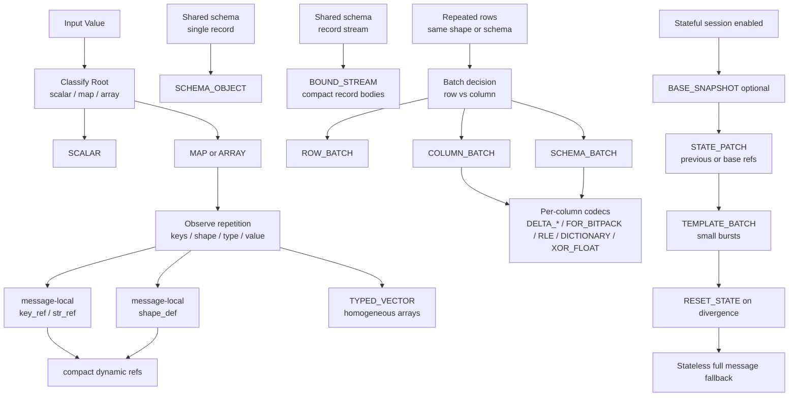

# Encoding Structure Diagram

This diagram shows how an encoder typically moves from baseline dynamic forms to more compact forms as repetition appears.

Notes:

- Message-local `shape_def`, `key_ref`, and `str_ref` drive compact dynamic reuse without persistent session state.
- Persistent CONTROL table updates require a separately negotiated stateful extension.
- `BOUND_STREAM` is preferred when a schema is bound once and records can omit per-record envelopes.
- `COLUMN_BATCH` becomes more effective as row count and column regularity increase.
- `SCHEMA_BATCH` is the preferred columnar form when every row shares a schema; `BOUND_STREAM` is the row-wise raw stream form.
- `STATE_PATCH` is beneficial only when sender and receiver state are synchronized.
